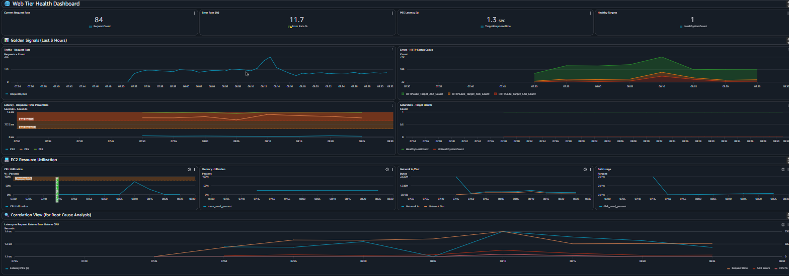
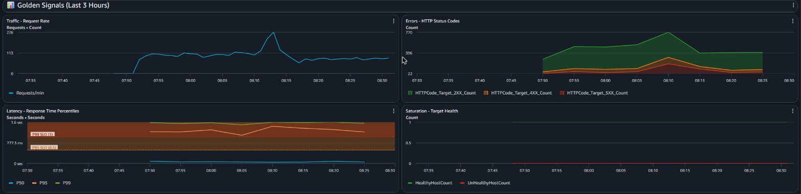
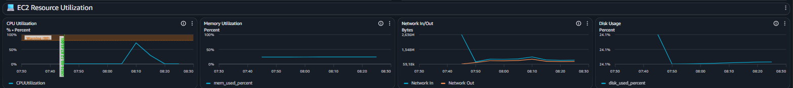
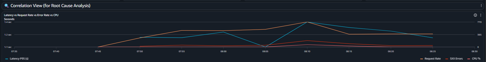
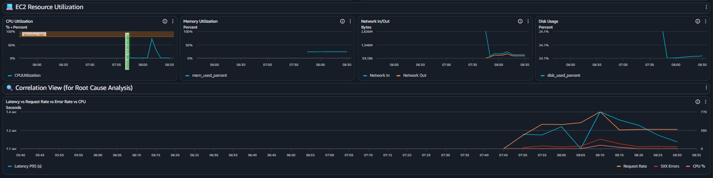

# Lab M6.03 — Web Tier Health Dashboard

A CloudWatch dashboard for a web tier (Application Load Balancer + EC2), built
around the four Golden Signals and laid out to be read top-to-bottom during an
incident.

**Dashboard:** `WebTierMonitoring` (us-east-1)
**Lab repo:** https://github.com/cloud-engineering-bootcamp/ce-lab-build-dashboard-web-tier

---

## What was built

| Resource | Value |
|---|---|
| EC2 instance | `i-06208cc8863bd3bbc` (`t3.micro`, AL2023, tag `Name=logging-lab`, detailed monitoring on) |
| Load balancer | `logging-lab-alb` → `app/logging-lab-alb/f3f577325c1f0df6` |
| Target group | `logging-lab-tg` → `targetgroup/logging-lab-tg/8fc5121b8174ca13` (HTTP :5000, health check `/health`) |
| Metrics | `AWS/ApplicationELB`, `AWS/EC2`, `CWAgent` (`mem_used_percent`, `disk_used_percent`) |
| Region | `us-east-1` |

The instance runs a small Flask app under systemd exposing `/`, `/health`,
`/slow`, `/notfound` and `/error`, so the dashboard could be validated against
real traffic containing a genuine mix of 2XX, 4XX and 5XX responses and a latency
distribution wide enough for P50/P95/P99 to separate.

> Prior labs' infrastructure had already been torn down, so the M6.01/M6.02
> instance was rebuilt from scratch (CloudWatch agent configured per M6.02 Part 3)
> before this lab's dashboard was created.

---

## Dashboard design rationale

The layout mirrors the sequence of questions asked during an incident, so the
dashboard does the triage work instead of leaving it to the responder:

```
┌──────────────────────────────────────────────────────────┐
│ 🌐 Web Tier Health Dashboard   env · region · on-call    │ ← who/where
├──────────────────────────────────────────────────────────┤
│ [Req Rate] │ [Error %] │ [P95 Latency] │ [Healthy Tgts]  │ ← is it broken NOW?
├──────────────────────────────────────────────────────────┤
│ [Traffic]              │ [Errors — status codes]         │ ← what KIND of
│ [Latency P50/95/99]    │ [Saturation — target health]    │   broken?
├──────────────────────────────────────────────────────────┤
│ [CPU]   │ [Memory]   │ [Network]   │ [Disk]              │ ← why?
├──────────────────────────────────────────────────────────┤
│ [Latency vs Requests vs Errors vs CPU]                   │ ← what caused what?
└──────────────────────────────────────────────────────────┘
```

Four principles drove it:

1. **Detection above diagnosis.** Golden Signals (symptoms users feel) sit above
   resource metrics (causes). You should never need to interpret a CPU graph to
   find out whether the site is up.
2. **Size encodes priority.** The correlation view is full width; Golden Signals
   are two-up; resource charts are four-up and smaller.
3. **Thresholds live on the chart.** SLO and warning lines are drawn as shaded
   annotations, so "is 0.47s bad?" becomes "is the line in the red band?"
4. **Colour is a signal, not decoration.** Red = page someone, orange = look into
   it, green = fine — consistently, everywhere.

Full reasoning, including the alternatives that were rejected, is in
[`config/design-decisions.md`](config/design-decisions.md).

---

## Widget explanations

Sixteen widgets across five bands. Summary below; per-widget detail with metrics,
statistics and dimensions is in [`config/widgets.md`](config/widgets.md).

| Band | Widgets | Type |
|---|---|---|
| Header | Environment, region, on-call and runbook links | `text` |
| KPI tiles | Current Request Rate · Error Rate % · P95 Latency · Healthy Targets | `singleValue` |
| Golden Signals | Traffic · Errors (stacked status codes) · Latency percentiles · Target health | `timeSeries` |
| Resources | CPU · Memory · Network In/Out · Disk | `timeSeries` |
| Correlation | Latency vs Request Rate vs 5XX vs CPU, dual axis | `timeSeries` |

**Golden Signals coverage:**

| Signal | Widget | Metric |
|---|---|---|
| **Latency** | Latency — Response Time Percentiles | `TargetResponseTime` p50/p95/p99 |
| **Traffic** | Traffic — Request Rate | `RequestCount` Sum |
| **Errors** | Errors — HTTP Status Codes | `HTTPCode_Target_{2,4,5}XX_Count` |
| **Saturation** | Saturation — Target Health + CPU/Memory/Disk | `HealthyHostCount`, `CPUUtilization`, `mem_used_percent`, `disk_used_percent` |

**Techniques used:**
- **Metric math** — `(m1/m2)*100` on the Error Rate tile, with the two raw inputs
  hidden via `visible: false`
- **Horizontal annotations** — P95 SLO at 0.5s, P99 SLO at 1.0s, CPU warning at
  80%, all with `fill: "above"`
- **Vertical annotation** — a green "Deployment" marker (bonus: deployment markers)
- **Stacking** — on status codes only, where the series genuinely sum to a whole
- **Dual axis** — in the correlation view only, via per-series `{"yAxis": "right"}`
- **`setPeriodToTimeRange`** — on the P95 tile, so it averages the whole selected
  range instead of flickering on each refresh

---

## How to use the dashboard

**Ten-second read:** the four tiles. Error Rate < 0.1%, P95 < 0.5s, Healthy
Targets at expected count, Request Rate in its normal band → the tier is fine.

**One-minute read:** the Golden Signals row, reading *shape* rather than absolute
values. Check Traffic first — it is the denominator that determines what every
other signal means.

**Deep dive:** resource row for the *why*, then the correlation view — find the
moment latency bent, read straight down that timestamp across the other three
series, and whichever moved first is the lead.

Full reading guide with thresholds: [`docs/dashboard-guide.md`](docs/dashboard-guide.md)
Symptom-to-cause playbook: [`docs/troubleshooting.md`](docs/troubleshooting.md)

### Deploy it

```bash
aws cloudwatch put-dashboard \
  --dashboard-name WebTierMonitoring \
  --dashboard-body file://config/dashboard.json

aws cloudwatch list-dashboards
```

On Windows, set `$env:AWS_CLI_FILE_ENCODING = "utf-8"` first — the CLI otherwise
decodes the file with the system codepage and rejects the emoji in the header.

---

## Screenshots

| | |
|---|---|
| **Full dashboard** |  |
| **Golden Signals** |  |
| **Resource utilization** |  |
| **Correlation view** |  |
| **Identifying an issue** |  |

---

## Reflection Questions

### 1. Why show P95 instead of average latency?

Because an average describes the *system* and a percentile describes *users*.

The average is dragged down by the fast majority and hides the slow tail
completely. A service where 95% of requests take 50ms and 5% take 4 seconds
averages to a healthy-looking 250ms — while one user in twenty stares at a
spinner. Worse, the average is exactly the statistic that a bimodal failure (a
cache miss path, one bad host, a slow shard) is best at concealing, so it is
least trustworthy precisely when something is going wrong.

P95 is a claim about people: 19 of every 20 requests came back within this time.
That maps directly onto an SLO, onto a support ticket, and onto a decision to
roll back. An average maps onto nothing anyone experiences.

Plotting P50, P95 and P99 together adds a second layer: the **gap** between them
is itself diagnostic. Tight and low is healthy; P50 flat while P99 climbs means a
subset of traffic is suffering; all three rising together means systemic
saturation. An average collapses all of that into one uninformative number.

### 2. What correlation patterns indicate problems?

The patterns matter more than any single threshold, which is why the correlation
view exists:

- **Traffic ↑ → CPU ↑ → Latency ↑ → Errors ↑**, in that order. Classic capacity
  exhaustion. The ordering is the evidence: load arrived first, so the system is
  a victim of demand rather than defective. This is the one case where scaling
  out is genuinely the fix.
- **Latency ↑ with traffic and CPU flat.** The instance is not working harder, so
  it is *waiting* — a database, a cache, an external API. Adding capacity to an
  idle-waiting system changes nothing.
- **Errors ↑ with traffic, CPU and latency all normal.** Infrastructure is
  healthy and the application is rejecting requests: a code or config fault. If
  the rise begins at the deployment marker, roll back before diagnosing.
- **Healthy targets ↓ → latency ↑ on the survivors.** Losing a target does not
  reduce traffic, it concentrates it. The secondary spike is a consequence, not
  a second incident — a distinction that matters when you are deciding what to
  fix under pressure.
- **Memory ↑ monotonically, then a cliff, with an error spike at the cliff.**
  A leak, an OOM kill, and a restart — three observations that only become one
  diagnosis when viewed on a shared timeline.
- **Traffic → 0 with everything else healthy.** The failure is upstream of the
  load balancer entirely. A perfectly healthy service with no traffic looks
  identical to a perfectly healthy service at 3am.

The unifying idea: a single metric moving is an *observation*; several metrics
moving in a specific order is a *diagnosis*.

### 3. Why group related metrics?

Because root cause analysis is fundamentally about temporal correlation, and
correlation is only visible when things share an x-axis.

Grouping does three concrete things:

- **It makes causality visible.** Two charts side by side with the same time axis
  let you see that CPU bent *before* latency did. On two separate dashboards you
  would be comparing timestamps by hand and by memory — slowly, and wrongly.
- **It reduces working-memory load.** During an incident, attention is the
  scarcest resource. Every context switch between screens costs an opportunity to
  lose the thread. Related metrics in one visual field mean the comparison
  happens in the eye rather than in the head.
- **It encodes a mental model.** Grouping by Golden Signal rather than by AWS
  service teaches the reader *how to think* about the system: symptoms first,
  then causes. A dashboard organised by namespace would instead teach them the
  shape of AWS's API, which is not the problem they are trying to solve.

The shared time range makes this concrete: drag-zoom on any chart and every
widget follows, so the whole dashboard becomes a single instrument focused on one
window of time.

### 4. How many metrics is too many on one dashboard?

The useful limit is not a metric count but a **comprehension** limit: too many is
the point at which a reader can no longer tell, at a glance, which number is the
one that matters.

Practical guidance:

- **Above the fold: at most 4–6 things.** These must be readable in seconds. This
  dashboard has exactly four tiles, one per Golden Signal.
- **Per chart: 3–5 series.** Beyond that the legend becomes the bottleneck and
  the lines start occluding each other. The latency chart has three; the
  correlation view pushes to four and is deliberately full width to compensate.
- **Per dashboard: roughly 10–20 widgets**, if and only if they are banded into
  labelled sections. This dashboard's 16 widgets work because the text dividers
  chunk them into five groups of four or fewer — a reader parses five things, not
  sixteen.

The real test is behavioural rather than numerical: **can someone unfamiliar with
the service decide, within ten seconds, whether to escalate?** If not, it is too
crowded regardless of the count. The second test: is every widget one you would
actually *act* on? Metrics added "for completeness" are pure noise — they cost
attention on every future incident and pay back nothing.

The failure mode is subtle. A cluttered dashboard is not merely less useful than
a sparse one; it is worse than none, because it creates confidence that the
system is being watched while ensuring nobody can see anything.

### 5. When would you create multiple dashboards?

Split when the *audience* or the *question* changes, not when you simply run out
of room.

- **Different audiences.** An executive wants availability and error budget burn.
  An on-call engineer wants Golden Signals. A database specialist wants
  connection pools and replication lag. Same system, three genuinely different
  dashboards — merging them serves nobody, because each reader has to filter out
  two thirds of the screen.
- **Different tiers.** Web, application, database, cache. Each has its own
  saturation signals and its own failure modes. A shared timeline links them; a
  shared *screen* just crowds them.
- **Different time horizons.** Real-time incident response (minutes) and capacity
  planning (weeks) want the same metrics at different periods, ranges and
  aggregations. One dashboard cannot serve both well.
- **Drill-down hierarchy.** A high-level overview linking to per-service detail
  dashboards. Start broad, narrow as the hypothesis narrows — this is the pattern
  that scales past a handful of services.
- **Different environments.** Production and staging must never share a screen.
  The cost of misreading which environment you are looking at, at 3am, is an
  outage caused by the person trying to fix one.

The heuristic: **one dashboard, one question, one audience.** When you catch
yourself saying "ignore the bottom half, that part is for the database team", the
split has already happened conceptually — the dashboard just has not caught up.

---

## Repository structure

```
.
├── README.md                     ← design rationale, widget summary, reflections
├── config/
│   ├── dashboard.json            ← complete dashboard body (real dimensions)
│   ├── widgets.md                ← every widget: metric, stat, dimensions, purpose
│   └── design-decisions.md       ← visualization choices + rejected alternatives
├── screenshots/
│   ├── 01-full-dashboard.png
│   ├── 02-golden-signals.png
│   ├── 03-resource-utilization.png
│   ├── 04-correlation-view.png
│   └── 05-identifying-an-issue.png
└── docs/
    ├── dashboard-guide.md        ← how to read it, with thresholds
    └── troubleshooting.md        ← symptom → cause playbook + dashboard faults
```

---

## Cleanup

```bash
aws cloudwatch delete-dashboards --dashboard-names WebTierMonitoring

aws elbv2 delete-load-balancer --load-balancer-arn $ALB_ARN
aws elbv2 wait load-balancers-deleted --load-balancer-arns $ALB_ARN
aws elbv2 delete-target-group --target-group-arn $TG_ARN

aws ec2 revoke-security-group-ingress \
  --group-id $INSTANCE_SG_ID --protocol tcp --port 5000 --source-group $ALB_SG_ID
aws ec2 delete-security-group --group-id $ALB_SG_ID

aws ec2 terminate-instances --instance-ids i-06208cc8863bd3bbc
```
